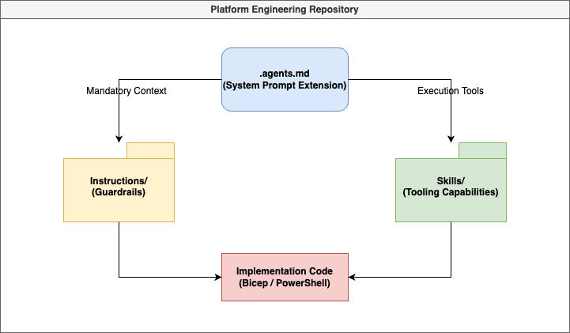

+++
title = 'Agent Ready Platform Repo'
date = 2026-02-02T18:50:18+01:00
draft = false
tags = ['AI', 'GitHub Copilot', 'Platform Engineering', 'Bicep', 'Azure', 'IaC']
+++

Hi! It's been a minute! Been trying to keep up with the latest trends in AI. Honestly, it's almost a full-time job.

I've been following what the capabilities are for quite some time now. I remember when Prompt engineer was the next thing, then came context engineering. Then we had MCP servers and agents... whole fleets!

Agents really changed the game! The latest addition is skills. Skills seem very promising... Here's where my experiment led me...

Oh, full disclosure I did use AI to help me out with the blog post... here we go!

# Building an Agent-Ready Platform Engineering Repository

In the world of Platform Engineering, automation is king. But as we move into the era of AI-augmented development, "standard" automation isn't enough. We need to build repositories that aren't just machine-readable, but **Agent-Ready**.

This post explores how we transformed a standard Azure IaC repository into a high-performance environment for GitHub Copilot and other AI coding agents.

## The Vision: Closing the "Agent Context Gap"

Standard repos are built for humans, but humans are surprisingly good at navigating ambiguity. We read between the lines of a README, we remember a Slack message about naming conventions, and we have "tribal knowledge" about why we use certain Azure modules over others.

Copilot and other AI agents don't have that. They suffer from the **Agent Context Gap**: the space between what's in your code and the unspoken rules in your head.

The goal isn't just "Better Autocomplete." We want to turn the AI into a **context-aware collaborator**. By providing a structured hierarchy of instructions and tools (Skills), we can turn an agent into a junior engineer that not only knows *how* to write Bicep code but understands **why** we use Azure Verified Modules (AVM) and **where** to find our local validation logic.

## The Architecture of an Agent-Ready Repo

Our repository, `platform-agent-kit`, follows a specific scaffold designed for AI interaction. But more important than the folder structure is the **Reasoning Framework** behind it.


*Figure 1: The dependency flow from mandatory context (.agents.md) to guardrails and execution tools.*

### 1. Instructions: The "Platform Engineering Constitution"
Instructions define **what "good" looks like**, not how to do things step-by-step. These are the immutable truths of our engineering culture that shouldn't change per task.

*   **Content:** Bicep linting rules, AVM expectations, PowerShell error handling standards, and Git conventional commit requirements.
*   **Role:** These are **always loaded** and **always respected**. They form the foundation that ensures the agent never forgets our core standards.

### 2. Skills: The "Procedural Tools"
Skills are for work that is multi-step, repeatable, and based on a process rather than a preference.

*   **Example:** A **Git Commit Generator** is a skill because it follows a deterministic workflow (analyze diff -> generate message). A **Bicep Expert**, on the other hand, is a knowledge domain that belongs in Instructions.
*   **Role:** Skills handle the heavy lifting of automated tasks like scaffolding or running Pester tests.

### 3. Prompts: The "Workflow Invocations"
Prompts are manual triggers for when you want to execute a specific, high-value workflow.

*   **Role:** Unlike instructions (which enforce behavior), prompts are **invocations**. They act as the "Start" button for complex routines, referencing both instructions for standards and skills for execution.

### 4. Agents: The "Domain Personas"
We avoid "agent swarms" and instead focus on one primary **Platform Engineer Agent** supported by specialized personas.

*   **Role:** Specialists (like a Bicep or PowerShell agent) are only triggered for deep, domain-heavy reasoning. They aren't running all the time; they are domain experts used through handoff workflows.

---

### The Mental Model: Hierarchy of Control
In an agent-ready repo, the hierarchy is clear: **Instructions > Agents > Skills > Prompts**. Instructions define how everything else behaves.

```text
.github/
  instructions/  # Culture, Expectations, Non-negotiables
  skills/        # Automated, procedural tools
  prompts/       # Reusable workflows
.agents.md       # The "System Prompt Extension" (Mandatory Context)
```

### 1. Context Injection (`.agents.md`)
The `.agents.md` file at the root acts as a persistent memory for any agent entering the workspace. It enforces repository-wide policies:
- **Mandatory Retrieval**: Agents *must* read specific instruction files before modifying Bicep or PowerShell code.
- **Skill Change Contract**: Any modification to a tool must include updated evaluation fixtures.

### 2. Progressive Disclosure & "Expert Hooks"
One of the biggest challenges with AI agents is **Context Fatigue**. If you dump every rule, standard, and script into the agent's memory at once, the "signal" of your current task gets lost in the "noise" of documentation.

We solved this using **Progressive Disclosure** in our `SKILL.md` files.

We don't force the agent to remember everything. Instead, we use **Trigger Keywords** (our "Expert Hooks"). For example, our Bicep skill description might say: *"Use this when the user mentions Azure, Bicep, or Infrastructure."*

By keeping the high-level descriptions concise, we protect the agent's precious token window. The agent only "opens" the full expertise—the complex regex for naming conventions or the specific Bicep linter codes—when it identifies a task that truly requires that knowledge. This ensures the agent's focus remains laser-sharp on the problem at hand.

### 3. Validation as a Coaching Loop
An agent is only as reliable as its feedback loop. In our `platform-iac` repo, we've moved validation from "CI-only" to "In-Agent."


*Figure 2: The self-healing loop where the agent triages compiler errors and auto-corrects based on remediation hints.*

We created a `bicep-validator` skill that doesn't just run `az bicep build` and fail. It **triages** the output. If the agent makes a mistake—like a parameter mismatch (BCP036)—the tool doesn't just error out. It provides a **Remediation Hint** directly in the agent's interaction flow.

This creates a "self-healing" developer experience. The agent breaks a rule, the tool coaches it on the fix, and the agent corrects itself—all before the human even sees the code. This turns validation from a "gatekeeper" into a "tutor," ensuring that the code that hits your PR is already pre-validated against your specific standards.

## Technical Deep Dive

### Azure Verified Modules (AVM) Decision Logic
We taught our agents **how to choose** between AVM and custom modules. Our AVM skill includes a decision tree:
1. **Reuse**: Always check for an existing AVM.
2. **Extend**: If AVM exists but lacks a feature, document the gap.
3. **Build**: Only build custom if no AVM exists.

### PowerShell Verb & Pester Standards
For our PowerShell automation, we integrated `PSScriptAnalyzer` and `Pester` into the agent's workflow. The `powershell-module-scaffolder` skill ensures every new function uses approved verbs (like `Invoke`, `Get`, `New`) and automatically generates a matching `.Tests.ps1` file.

## Lessons from the Journey: The "Agent-Ready" Mindset

Building this wasn't just about writing YAML and Markdown. It was a shift in how we think about "Infrastructure as Code."

*   **Constraints are Creative**: By giving the agent clear `NEVER` and `MANDATORY` lists, we actually made it *more* creative. It spends less time guessing what we want and more time solving the complex parts of the architecture.
*   **Documentation is Code**: In an agent-ready repo, your documentation *is* part of the execution path. If a standard isn't written in a way an agent can retrieve, it doesn't exist.
*   **Trust But Verify**: We don't just trust the agent to read the docs; we use `test/eval/` fixtures to prove that the agent's tools (the Skills) actually work as intended.

## Summary: The "Agent-Ready" Checklist

To make your repository Agent-Ready:
- [x] **Define your "Ground Truth"**: Use `.agents.md` for global rules.
- [x] **Modularize Instructions**: Don't let your README become a junk drawer.
- [x] **Build Validation Skills**: Give the agent the tools to test its own work.
- [x] **Create Evaluation Fixtures**: Provide examples of "Good" and "Bad" code for the agent to learn from.

## Additional resources
Here are some of the key resources I used to build and refine this setup:
- [VS Code Copilot Documentation](https://code.visualstudio.com/docs/copilot/overview) - The foundation for understanding how extension context works.
- [Anthropic Prompt Engineering Guide](https://docs.anthropic.com/en/docs/build-with-claude/prompt-engineering/overview) - Essential reading for structuring agent instructions and context.
- [Anthropic Skills Best practices](https://platform.claude.com/docs/en/agents-and-tools/agent-skills/best-practices)
- [agentskills.io](https://agentskills.io/home)
- [skills.sh](https://skills.sh/)

## What's Next?
You can find the code here: [platform-agent-kit](https://github.com/irwins/platform-agent-kit).
It's a work-in-progress...

By treating AI as a first-class citizen in our repo structure, we've ensured that every line of code—whether written by a human or an agent—meets our platform standards... Well at least that's what we're aiming for... 😉

Ttyl,

Urv