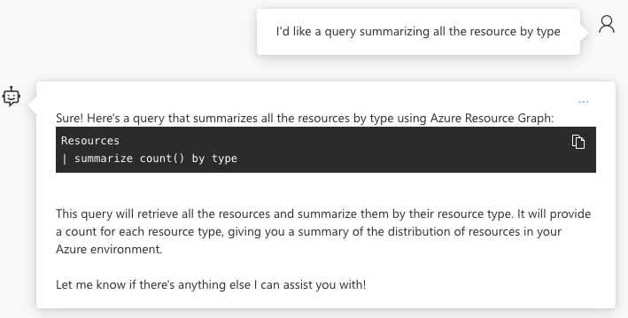
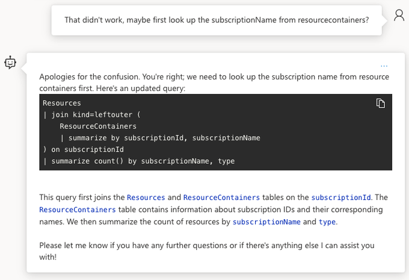
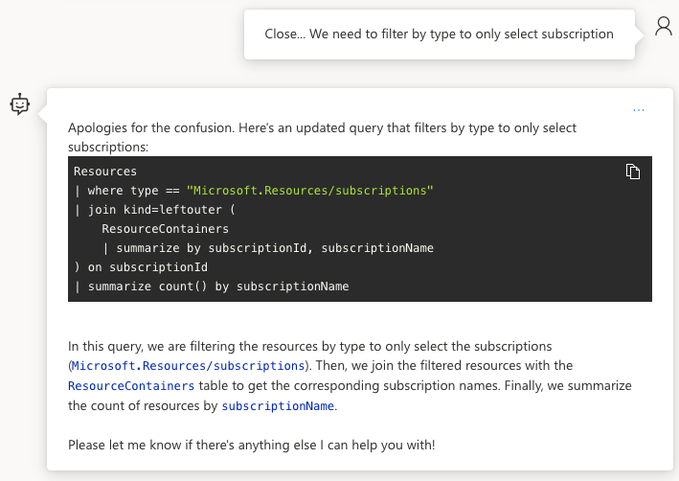

+++
title = 'Azure OpenAI Assistant'
date = 2024-03-01
tags = ['Development', 'OpenAIAssistant', 'AzureOpenAI']
draft = false
+++

## OpenAI is the next shiny thing

I've been following OpenAI developement closely ever since its inception. I was a bit hesitant on upgrading, fearing I wouldn't use its full potential (Also I'm quite frugal...:smirk:). Fortunately there's also a pay-as-you-go plan for using the API directly. This gives you more control on your credits.

When Microsoft announced their version, I was excited about it, as I'm always in Azure. I also have a monthly credit to spend. You do need to [apply](https://aka.ms/oaiapply) for it, but that process is quite easy. Once you gain access the fun can begin!

FYI, the beauty of Azure OpenAI is that it [follows](https://platform.openai.com/docs/assistants/overview) the REST API model of OpenAI closely. That makes transitioning smoothly from one to the other. Have a look at the [documentation](https://learn.microsoft.com/en-us/azure/ai-services/openai/overview) for a better understanding of the capabilities.

## What is Azure OpenAI Assistant

I like OpenAI's definition:

> An Assistant has instructions and can leverage models, tools, and knowledge to respond to user queries.

Think of an assitant as a soundboard, where you you can exchange thoughts and ideas. For better results you need to optimize your instructions, but that is a topic for another time.

It took me quite some time to grasp this concept. At first I was using the assistant as a google search. An assistant is more than that. With proper instructions, you can have pretty meaningful conversations. It all comes down to your prompting skills. [Prompt engineering](https://platform.openai.com/docs/guides/prompt-engineering) is a thing! It really is the gateway for better results. How to get better at it? Trial and error... Like everything, practice, practice, practice!

## Setting up Azure OpenAI instance

Once you're eligble for the OpenAI you can deploy your OpenAI resource. Assistant is currently in _Preview_ and only available from specific regions. I've defaulted to _East US 2_.

You can do this all in the [portal](https://learn.microsoft.com/en-us/azure/ai-services/openai/assistants-quickstart?tabs=command-line&pivots=rest-api#set-up), but I was curious if there was support for bicep deployment. There is...:smile:

```bicep
@minLength(2)
@maxLength(64)
@description('Name of the AzOpenAI instance')
param name string = //Instance name. This has to be unique

@description('AzOpenAI instance kind')
param accountKind string = 'OpenAI'

@minLength(1)
@description('Primary location for all resources')
param location string = 'eastus2'

param deployments array = [
  {
    name: 'assistant'
    model: 'gpt-35-turbo'
    format: 'OpenAI'
    version: '0301'
    sku: 'Standard'
    capacity: 120
  }
]

param sku string = 'S0'

param tags object = {
  environment:'DEV'
  createdBy: //Your persona
}

resource open_ai_account 'Microsoft.CognitiveServices/accounts@2023-05-01' = {
  name: name
  location: location
  tags:tags
  kind: accountKind
  sku: {
    name: sku
  }
  properties: {
    customSubDomainName: toLower(name)
  }
}

resource open_ai_deployment 'Microsoft.CognitiveServices/accounts/deployments@2023-05-01' = [for deployment in deployments: {
  parent: open_ai_account
  name: deployment.name
  sku: {
    name: deployment.sku
    capacity: deployment.capacity
  }
  properties: {
      model: {
        name: deployment.model
        format: deployment.format
        version: deployment.version
      }
      raiPolicyName: 'Microsoft.Default'
      versionUpgradeOption: 'OnceNewDefaultVersionAvailable'
  }
}]

output endpoint string = open_ai_account.properties.endpoint
output id string = open_ai_account.id
output name string = open_ai_account.name
```

Here's the bicepparam to accompany the bicep file.

```bicep
using 'main.bicep'

param location = 'eastus2'
param name = //Unique instance name
param sku = 'S0'
param tags = {
  environment: 'DEV'
  createdBy: 'Irwin Strachan'
}
```

At this point a pipeline may be a bit much, so here's how to deploy using the az cli.
What? No PowerShell?!? A poor craftsman always blames his tools...There is merit in having more than one skill...:wink:

```bash
### LOGIN TENANT
TENANT_ID= #Your Tenant
SUBSCRIPTION_ID= #Subscription you applied

az login --tenant $TENANT_ID
az account set --subscription $SUBSCRIPTION_ID

### CREATE RESOURCE GROUP
RESOURCE_GROUP_NAME=rg-openai
LOCATION=eastus2

az group create -n $RESOURCE_GROUP_NAME -l $LOCATION

### Deploy main bicep template using bicep parameters file

### Lint bicep file
az bicep lint --file #Refer to your bicep file

### Validate bicep file
az deployment group validate \
    --resource-group $RESOURCE_GROUP_NAME \
    --parameters #Refer to your bicepparam file

### Preview bicep file
az deployment group what-if \
    --resource-group $RESOURCE_GROUP_NAME \
    --parameters #Refer to your bicepparam file\
    --template-file #Refer to your bicep file

az deployment group create \
    --resource-group $RESOURCE_GROUP_NAME \
    --parameters #Refer to your bicepparam file
```

Ok now that we've deployed our instance we can get down to business!

## Using Aure OpenAI Assistant

As an introduction I'd advice using the _Studio_ to browse around. Once your comfortable you can give Doug Finke his [PowerShellAIAssistant](https://github.com/dfinke/PowerShellAIAssistant) module a try. It supports both OpenAI & AzureOpenAI :smile:. Doug has contributed quite a few popular modules over the years with [ImportExcel](https://www.powershellgallery.com/packages/ImportExcel/7.8.6) being "the chef's kiss"

Ok so up to this point, you've done your deployment and now you can create your assistant...

### Instructions

To better guide the personality of an assistant, instructions are needed. The more precise the better. I found a great [GitHub](https://github.com/f/awesome-chatgpt-prompts) repo that taught me a thing or two. Feel free to sponsor if you find it useful.

I've been doing a bit of Azure Resource Graph queries. Why not see how assitant could help? :grin:

Here's my instruction: _I want you to act as a an azure resource graph specialist. You're skilled at creating kusto queries for managing, monitoring and optimising Azure Resources._

Did I mention Doug Finke also has a module called [PSWeave](https://github.com/dfinke/PSWeave).The InstructionPrompts are way more elaborate. For now, I'll use a simpler approach. Prompting is a different mindset.

### Conversing with AzOpenAI assistant

With an assistant, you can have a conversation. It's not a google search. The sooner you realize that, the more patience you'll have :smile:

Let's start the assistant off with something easy.



Nice! It gave me a query that worked! Let's add the _subscriptionName_ as well


Ah, close. Here's where I'd get frustrated in the past and just give up. I know what it needs to be... Let's see if I can guide the assistant to better results.



Impressive! It came back with the join kind=leftouter. It still won't work but we're heading in the right direction. Remember trust, but verify.



Told the assistant I made a mistake and where I was expecting the resource type.


This is what I was expecting the first time around. If you're like me you'd probably have quit after the first attempt. Using AI doesn't mean you don't have to be knowledgable about the subject... By having a conversation I was able to coach the assistant to what I wanted.


Here's where the work I did started to payoff. The assistant uses what we discussed to improve on future request. I asked the assitant to return _bastion_ only. While processing the whole experience , I thought, why not ask the assistant where I could've improved my _prompt_ for a better experience.


## Conclusion

The sooner you realise, this isn't a google search, but more of a conversation that helps explore the possibilities, the more fun you'll start having... Don't expect perfection, Have fun learning this new skill!

## Additional resources

- [Azure Resource documentation](https://learn.microsoft.com/en-us/azure/governance/resource-graph/)
- [Azure Resource Graph for Azure Monitor](https://learn.microsoft.com/en-us/azure/azure-monitor/resource-graph-samples?tabs=azure-cli)
- [Azure Monitor Ninja training](https://github.com/eshlomo1/Azure-Monitor-Ninja-Training/tree/master)
- [Awesome ChatGPT Prompts](https://github.com/f/awesome-chatgpt-prompts)
- [PowerShellAIAssitant](https://github.com/dfinke/PowerShellAIAssistant)
- [PSWeave](https://github.com/dfinke/PSWeave)
