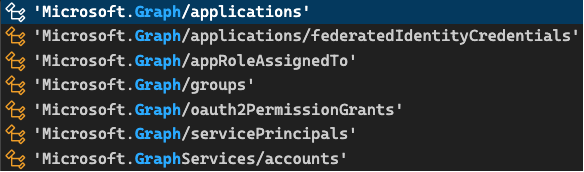
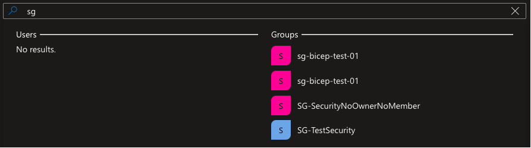

+++
title = 'Bicep Graph Support'
date = 2024-06-16T05:11:56+02:00
draft = false
tags = ['EntraId', 'Graph', 'bicep', 'IaC']
+++

Bicep support for Microsoft Graph was a long anticipated feature! Supporting Microsoft Graph in bicep allows you to define the tenant infrastructure (think EntraId among other things) you want to deploy. Currently a subset is support (As of 24th May 2024).



For those new to [bicep](https://learn.microsoft.com/en-gb/azure/azure-resource-manager/bicep/overview?tabs=bicep), bicep is a domain-specific language (DSL) that uses declarative syntax to deploy resources

Just a quick heads up it still is in preview aka not ready for production :grin:

## Why bother?

As it so happens I need to create some security groups as part of a migration. I'm a fan of any and eveything IaC (Infrastructure as Code) related! Having this as part of your solution avoids manual configuration and helps with enforcing your desired environment states.

I think it's really cool being able to deploy a security group using bicep! Don't get me wrong, nothing wrong with using Powershell :wink:

Let's dive in shall we?

## Deploying security groups using bicep

To get started we need to enable the bicep preview feature by configuring _*bicepconfig.json*_

```json
{
    "experimentalFeaturesEnabled": {
        "extensibility": true
    }
}
```

In the main.bicep, we need to supply the provider. Type _provider microsoftGraph_, to let the compiler know that you're using Microsoft Graph types.

After that it's business as usual if your already familiar with authoring bicep files, a skillset well worth investing in!

I added a managedIdentity in the mix as well, more on that later...
Here's what the main.bicep file looks like

```bicep
provider microsoftGraph

param location string = resourceGroup().location

param securityGroupDisplayName string = 'myBicepSecurityGroup'

param managedIdentityName string = 'myBicepManagedIdentity'

resource securityGroup 'Microsoft.Graph/groups@v1.0' = {
  displayName: securityGroupDisplayName
  mailEnabled: false
  mailNickname: securityGroupDisplayName
  securityEnabled: true
  uniqueName: guid('${toLower(securityGroupDisplayName)}','${managedIdentity.id}','${tenant().tenantId}')
  owners: [
    managedIdentity.properties.principalId
  ]
}

resource managedIdentity 'Microsoft.ManagedIdentity/userAssignedIdentities@2018-11-30' = {
  name: managedIdentityName
  location: location
}

output managedIdentityResource object = {
  managementIdentityPrincipalId: managedIdentity.properties.principalId
  managementIdentityDisplayName: managedIdentity.name
}

output securityGroupResource object = {
  securityGroupObjectId: securityGroup.id
  securityGroupUniqueName: securityGroup.uniqueName
}
```

The property that peaked my interest was _uniqueName_. I hadn't seen that before. In the past I made use of a psuedo hash in order to distinguish my security group. Here's the thing we all ran into at some point. You create a security group in EntraId (Ok this was back in the AzureAd era) only to end up with multiple versions if you're not careful. If your script wasn't idempotent your could end up with multiple versions. The displayName would be the same, just another objectId. Hence, why filtering on displayName isn't always a great experience. Case in point:



My first attempts playing with uniqueName

The uniqueName reminds me of Acitive Directory's _sAMAccountName_

The beauty of the uniqueName is that it's immutable. I knew immediately that the uniqueName would be guid generated in bicep!

```bicep
uniqueName: guid('${toLower(securityGroupDisplayName)}','${managedIdentity.id}','${tenant().tenantId}')
```

I can generate a guid using: displayName (security group), managedIdentityId and tenantId. Now you can always determine which object you meant to apply! Happy days, expect this is still in preview... :pensive:

Here's some documentation to read up this: [group-upsert](https://learn.microsoft.com/en-us/graph/api/group-upsert?view=graph-rest-1.0&tabs=http)
I can't say for sure how long it's been there, I know about it now... :wink:

## Using uniqueName in PowerShell

While I'm tempted to just go ahead and use it in production (Don't!) it got me thinking, where is this uniqueName in the cmdlets? and how can I harness this power?

I remember wanting the same function used in bicep to generate a guid in PowerShell. Turns out you can! **Simon Wahlin** has created a module [AzExpression](https://www.powershellgallery.com/packages/AzExpression/0.2.7) that delivers this functionality!

Let's give that a try, we'll create a security group in bicep (with the generated guid) and retrieve in PowerShell using AzExpression to generate the guid. We've got the bicep bit covered.

As much as I love PowerShell when it comes to bicep deployment, I prefer az cli.

> A poor craftsman always blames his tools...

```bash
### Deploy main.bicep
    TENANT_ID=<your-tenant-id>
    SUBSCRIPTION_ID=<your-subscription-id>
    LOCATION=<location>

    az login --tenant $TENANT_ID
    az account set --subscription $SUBSCRIPTION_ID

    ### CREATE RESOURCE GROUP
    RESOURCE_GROUP_NAME=entra-id-rg
    az group create \
        -n $RESOURCE_GROUP_NAME \
        -l $LOCATION \
        --tags "Environment=Dev"

    az group exists -n $RESOURCE_GROUP_NAME

    ### Lint bicep file
    az bicep lint --file main.bicep

    ### Validate bicep file
    az deployment group validate \
        --resource-group $RESOURCE_GROUP_NAME \
        --parameters main.bicepparam

    ### Preview bicep file
    az deployment group what-if \
        --resource-group $RESOURCE_GROUP_NAME \
        --parameters main.bicepparam \
        --template-file main.bicep

    utcNow=$(date -u +"%Y%m%d%H%M%S")

    az deployment group create \
    --name entraId-$utcNow \
    --resource-group $RESOURCE_GROUP_NAME \
    --template-file main.bicep \
    --parameters main.bicepparam
```

You'll get a warning letting you it's an experimental feature. Here's how to retrieve the security group using the generated guid from AzExpression using PowerShell

```pwsh
[CmdletBinding()]
Param (
    [string]$ManagedIdentityId ,

    [string]$GroupName ,

    [string]$TenantId
)

#region verify module is installed
$requiredModule = Get-Module -Name Microsoft.Graph.Groups -ListAvailable

if (!$requiredModule) {
    Write-Output "Installing required PowerShell module 'Microsoft.Graph.Groups'"

    Install-Module `
        -Name 'Microsoft.Graph.Groups' `
        -Force `
        -Scope CurrentUser `
        -SkipPublisherCheck `
        -AllowClobber `
        -Repository PSGallery
}

$null = Connect-AzAccount -TenantId $TenantId

$accessToken = Get-AzAccessToken -ResourceUrl 'https://graph.microsoft.com/'
$null = Connect-MgGraph -AccessToken $($accesstoken.Token | ConvertTo-SecureString -AsPlainText -Force) -NoWelcome

$uniqueName = New-AzGuid -InputStrings $GroupName.ToLower(), $ManagedIdentityId, $TenantId

"UniqueName: $uniqueName"

Get-MgGroupByUniqueName -UniqueName $uniqueName
```

The guid is case-sensitive. That's the reason for converting displayName tolower(), maybe the managedIdentity should also be converted... :thinking:

I used it to retrieve the security group. New-MgGroup supports the uniqueName. I didn't see that property on New-AzAdGroup.

## Some things to consider

### Portal experience uniqueName

Searching in the portal with the uniqueName doesn't return anything. Not sure if that is intentional. You'll need to know the uniqueName. Granted you can keep it simple, I thought that generating a guid made for a pretty unique experience... Hehe...Couldn't help myself...:smiley:

You can also use the Get-AzAdGroup (Az.Resources) using the filter:

```pwsh
Get-AzAdGroup -Filter "uniqueName eq '<uniqueName>'"
```

That works just fine. I'd advice using New-MgGroup to create a security group supporting uniqueName. Either that or [upsert](https://learn.microsoft.com/en-us/graph/api/group-upsert?view=graph-rest-1.0&tabs=http). Making the REST API call keeps you in control, no need to download modules. The graph modules can sometimes be a chore to work with.

### Permissions

If you're using a ServicePrincipal or ManagedIdentity you'll need to set up the proper Graph API [permissions](https://learn.microsoft.com/en-us/graph/api/group-upsert?view=graph-rest-1.0&tabs=http).

>Update: I got a crash course from [Alexander Nikolić](https://x.com/alexandair) on Graph scoping. Turns out that when you aquire an accessToken from AzPS you get AzPS scopes, not yours. I had a quick look and saw that the scope included _Directory.AccessAsUser.All_. That explains why it worked. I have too much permissions in my own tenant (Hey, it's where I do research... :wink:). You can read more about that on the [Microsoft Graph Permission Explorer](https://graphpermissions.merill.net/permission/Directory.AccessAsUser.All) courtesy of [Merill Fernando](https://x.com/merill). Thanks for bringing that to my attention!

For production I'd strongly advice using a Service principal with the proper Graph API permissions...

## Conclusion

Having the microsoftGraph provider in bicep definitely is a game changer! It will bring you one step closer to having everything as IaC. Can't wait until it isn't experimental anymore.

Ttyl/Urv

## Additional resources

- [New-AzAdGroup](https://learn.microsoft.com/en-us/powershell/module/az.resources/new-azadgroup?view=azps-12.0.0)
- [Get-AzAdGroup](https://learn.microsoft.com/en-us/powershell/module/az.resources/get-azadgroup?view=azps-12.0.0)
- [New-MgGroup](https://learn.microsoft.com/en-us/powershell/module/microsoft.graph.groups/new-mggroup?view=graph-powershell-1.0#examples)
- [Get-MgGroupByUniqueName](https://learn.microsoft.com/en-us/powershell/module/microsoft.graph.groups/get-mggroupbyuniquename?view=graph-powershell-1.0)

## Appendix

- [Announcing public preview of Bicep templates support for Microsoft Graph](https://devblogs.microsoft.com/identity/bicep-templates-for-microsoft-graph-resources/)
