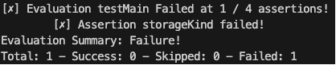

+++
title = 'Bicep Testing Framework'
date = 2024-06-22T07:07:04+02:00
draft = false
tags = ['Pester', 'Test', 'bicep', 'IaC']
+++

Bicep is my goto IaC tools for deploying Azure Resources! I recently had a discussion with my team about validating deployments. Now validation is something I'm familiar with using Pester :wink:. I remembered reading about bicep having an experimental feature for testing. I though I'd give it a try.

Just a quick heads up it still is in preview aka not ready for production :grin:

## Why validate?

Some times, you just want to be sure of the current state of a configuration. Is property value really set as I expect? Now you can look it up manually (I'd advice against that) or you could use code... Pester has saved me many of times... Let's see if bicep can do the same...

## Setting up bicep for testing

### Enable assertions and testFramework

The bicep experimentalFeature needs to be enabled. You can do this by adding it to the _bicepconfig.json_ file

```Json
{
    "experimentalFeaturesEnabled": {
        "testFramework": true,
        "assertions": true
    }
}
```

### Create test.bicep to author test

I'm keeping it simple and just deploy a simple storageAccount, just to see what I'm working with...

```bicep
test testMain 'main.bicep' = {
  params: {
    location: 'westeurope'
    kind: 'StorageV2'
    skuName: 'Standard_LRS'
    storageAccountName: 'stBicepTest'
  }
}
```

To author the test you use the test keyword, give it a name and a reference to the bicep file to test.

There are some limitations:

- You must pass in a parameter object, you cannot reference an existing parameter file currently
- Test blocks must be in a separate file from the .bicep template you want to test
- Test result output summary is not standardized

### Author assert statements within the referenced bicep file

Now for the assertions. The _assert_ statements can be any boolean expression that references parameters, variables, or resource names. These boolean expressions can include Bicep functions such as "contains()", "length()", etc.

```bicep
param storageAccountName string = 'st${uniqueString(resourceGroup().id)}'

param location string = resourceGroup().location

param kind string = 'StorageV2'

param skuName string = 'Standard_LRS'

resource storageAccount 'Microsoft.Storage/storageAccounts@2019-06-01' = {
  name: storageAccountName
  location: location
  kind: kind
  sku: {
    name: skuName
  }
}

//Test expected values
assert storageKind =  kind == 'StorageV2'
assert storageSkuName = skuName == 'Standard_LRS'
assert storageLocation = contains(location,'europe')

//Test expected naming convention
assert storageName = startsWith(storageAccount.name,'st')

output storageAccount array = [{
    name: storageAccount.name
    id: storageAccount.id
    kind: storageAccount.kind
    skuName: storageAccount.sku.name
}]

```

Here are some limitations you should know of:

- You can only assert on parameters, variables, and resource names with current functionality
- You cannot assert on resource size, location, or other propreties yet as these depend on runtime deployment functionality

Here is what that means for the following assertions:

```bicep
//This won't work. It depends on runtime deployment fucntionality
assert storageSkuName = skuName == storageAccount.sku.name

//This is hardcore to validate only for 'Standard_LRS'
//Note: Look into bicep array functions
assert storageSkuName = skuName == 'Standard_LRS'

//This asserts if location is somewhere in europe
assert storageLocation = contains(location,'europe')

//Resource name starts with 'st'
assert storageName = startsWith(storageAccount.name,'st')
```

### Run bicep test

The moment we've all waited for! To execute the test run the following:

```bash
bicep test bicep/test.bicep
```

It passed!


Ok, I was expecting each assertion in the test. I tried looking up if there was flag to expand the output... I didn't find any. It's experimental, so I can't complain.

But what does a failed test looks like? I'm glad you asked!

```bicep
test testMain 'main.bicep' = {
  params: {
    location: 'westeurope'
    kind: 'StorageV1' //This should complain it's not 'StorageV2'
    skuName: 'Standard_LRS'
    storageAccountName: 'stBicepTest'
  }
}
```

It failed!



storageKind assertion failed. The evaluation did metion that 1/4 assertions failed. Again I was expecting to see the ones that were succesful as well... I'm sure it's a flag I don't know about...

Let's add one more failure

```bicep
test testMain 'main.bicep' = {
  params: {
    location: 'westeurope'
    kind: 'StorageV1' //This should complain it's not 'StorageV2'
    skuName: 'Standard_LRS'
    storageAccountName: 'slBicepTest' //StorageAccount name should start with 'st'
  }
}
```


Ok! Both failed as expected!

## Conclusion

The current bicep test functionality is more akin to validating parameters values and naming conventions. If your naming convention dictates that you storage account name starts with 'st' then sure by all means use it. What I'm really interested in, is validating _after_ the deployment. Bicep test  doesn't support runtime deployment functionality at the moment.

I asked  the community if it's worth investing. Currently development is on hold. I'd agrue using pester might be a better fit for validating actual deployments! That will be for a next time :wink:

## Additional resources

- [Bicep experimental test framework](https://github.com/Azure/bicep/issues/11967)
- [Proposal: Bicep testing framework](https://github.com/Azure/bicep/issues/11966)

## Appendix

- [pester](https://pester.dev/)