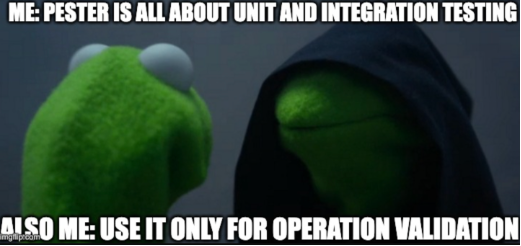
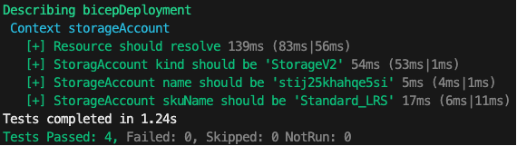

+++
title = 'Pester Validation Deployments'
date = 2024-06-28T15:24:38+02:00
draft = false
tags = ['Pester', 'Test', 'bicep', 'IaC','Azure']
+++

Previously, I had a look at the [bicep testing framework](https://irwins.github.io/blog/posts/bicep-testing-framework/). The assertions done are more to validate parameter,variables and resource names. You can't assert resource size, or properties, as they depend on runtime deployment. I think pester will be a great fit for this :wink:

[Pester](https://pester.dev/) is *the* test framework for PowerShell! When I first got introduced to pester it was for unit testing. As someone who identifies with OPS, it didn't resonate with me, until I saw Kevin Marquette use pester to [validate](https://pshirwin.wordpress.com/2015/11/06/pester-script-to-test-dns-configuration/) outcome of what a script was suppose to do. That changed my life!

This is me everytime Is sit down to use pester :grin:



Pester is definitely worth looking into. Pester v6 is in the works as we speak! Let's have a look at what pester could mean for us post bicep deployment...

## Why validate?

Validating the outcome of what you expect is a game changer. No more guessing! Back in the days I did quite a lot of Active Directory migrations. It feels good knowing that your script did what you expect. Sometimes there was a glitch and pester would pick it up for you.

Why would you validate post deployment? I mean if the deployment was successful, doesn't that mean things are as you would expect? Sounds like **yak shaving** to me... Ok hear me out...

Say you deployed a solution using bicep and it was successful, yet someone went into the portal and changed a vital property. how would you know? It may/may not break. Ideally you'd update your solution and redeploy, IaC remember? Using pester you can quickly validate the current state of your deployed resources. Think configuration drift, did things changed considerably?

And before you come after me, terraform has something like this in the form of a plan :grin:

>Azure recently introduced [deployment stacks](https://learn.microsoft.com/en-us/azure/azure-resource-manager/bicep/deployment-stacks?tabs=azure-powershell). Also worth looking into

While there may be valid arguements to use other tools/concepts, let us use pester and see where this goes... shall we?

## Setting up bicep for pester testing

How would you go about testing post bicep deployments? My first idea was to have JSON config file. Defintely doable, but no. I'd like validate the deployment. That's where _output_ comes in. Output can give you more information at runtime. The biggest challenge is validating the right properties. The goal isn't to validate for validation's sake, it should add value.

```bicep
param storageAccountName string = 'st${uniqueString(resourceGroup().id)}'

param location string = resourceGroup().location

param kind string = 'StorageV2'

param skuName string = 'Standard_LRS'

resource storageAccount 'Microsoft.Storage/storageAccounts@2019-06-01' = {
  name: storageAccountName
  location: location
  kind: kind
  sku: {
    name: skuName
  }
}

output storageAccount object = {
    name: storageAccount.name
    id: storageAccount.id
    kind: storageAccount.kind
    skuName: storageAccount.sku.name
}
```

The key here is to output what you want to validate.

The next step is to grab the deployment output

```pwsh
$deployment = Get-AzResourceGroupDeployment -ResourceGroupName 'bicep-assert-rg' |
    Sort-Object -Property Timestamp -Descending |
    Select-Object -First 1

$deploymentOutput = ($deployment.Outputs.storageAccount | ConvertTo-Json -Depth 10 | ConvertFrom-Json).Value
```

Best practice is to give your deployments [unique names](https://learn.microsoft.com/en-us/azure/azure-resource-manager/bicep/deploy-cli#deployment-name)
Just to keep it simple, grab the deployments from the resource group and sort on TimeStamp descending, selct the first object. This will give you the latest deployment. You may/may not need additional filtering, but you get the drift :wink:

To get the deployment Output as a PowerShell object I needed to _ConvertTo-Json_ and then _ConvertFrom-Json_ That took a bit of puzzling.

## Create the pester test

Ok here's the fun bit, the pester test!

```pwsh
[CmdletBinding()]
Param (
    [Object]$DeploymentOutPut
)

Describe "bicepDeployment" {
    BeforeAll {
        $script:azResource = Get-AzResource -ResourceId $deploymentOutput.id
    }
    Context "storageAccount" {
        It "Resource should resolve" {
            $azResource | Should -Not -BeNullOrEmpty
        }
        It "StoragAccount kind should be '$($deploymentOutput.kind)'" {
            $azResource.Kind | Should -Be $deploymentOutput.kind
        }
        It "StorageAccount name should be '$($deploymentOutput.name)'" {
            $azResource.Name | Should -Be $deploymentOutput.name
        }
        It "StorageAccount skuName should be '$($deploymentOutput.skuName)'" {
            $azResource.Sku.Name | Should -Be $deploymentOutput.skuName
        }
    }
}
```

_*deployment.tests.ps1*_

I'm passing the deploymentOutput as a parameter, the expected values. Before running the test let's verify that the resourceId actually resolves. Using Get-AzResource is enough for our testing purposes. From there we can validate the actual value to the expected value.

To execute the test do the following

```pwsh
$container = New-PesterContainer `
    -Path 'bicep/deployment.tests.ps1' ` #Path to your pester test
    -Data @{ DeploymentOutPut = $deploymentOutPut}

Invoke-Pester `
    -Container $container `
    -CI `
    -Output Detailed
```

Pester v5 setup is a bit different. Be sure to visit [pester.dev](https://pester.dev) for more information on running pester tests.



Nice! The tests passed. Like someone once told me, never trust a test that doesn't fail... Let's do that!

```pwsh
$failedDeployment = [PSCustomObject]@{
    id = $deploymentOutput.id
    kind = 'FileStorage'
    name = 'bicepassertsa'
    skuName = 'Standard_LRS'
}

$failedContainer = New-PesterContainer `
    -Path 'bicep/deployment.tests.ps1' `
    -Data @{ DeploymentOutPut = $failedDeployment}

Invoke-Pester `
    -Container $failedContainer `
    -CI `
    -Output Detailed
```

I intentionally changed the kind and name. Here's what a failed test looks like


The kind and name test failed as expected.

## Conclusion

Pester can definitely help with validating post runtime deployment! It's a great way to detect configuration drift. I realize there are other ways of doing this. I do have some terraform skills as well, but I prefer bicep for anything Azure related when IaC is required. Azure deployment stack is the new kid on the block. It'll be interesting to see how that evolves.

Using pester to validate deployments is an option, yet another tool you can add to your toolbox. Having unique deployment names, makes a deployment much like a snapshot, giving you leverage on your validation time frame. You could potentionally go back even further and verify when a configuration drift started. You could also use a scheduled pipeline to keep track of your solution expected outcome. The possibilities... :grin: I hope this is some value to you!

Ttyl,

Urv

## Additional resources

- [Bicep experimental test framework](https://github.com/Azure/bicep/issues/11967)
- [Proposal: Bicep testing framework](https://github.com/Azure/bicep/issues/11966)
- [Terraform plan](https://developer.hashicorp.com/terraform/cli/commands/plan)
- [Azure deployment stack](https://learn.microsoft.com/en-us/azure/azure-resource-manager/bicep/deployment-stacks?tabs=azure-powershell)

## Appendix

- [pester](https://pester.dev/)