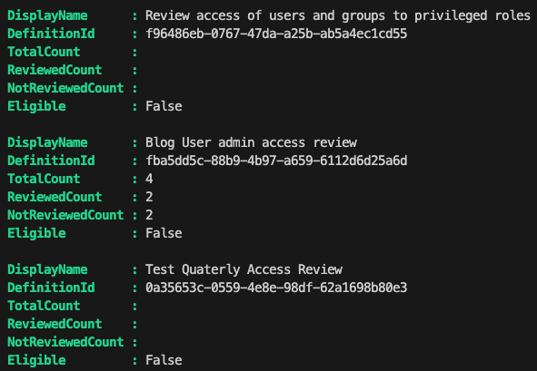
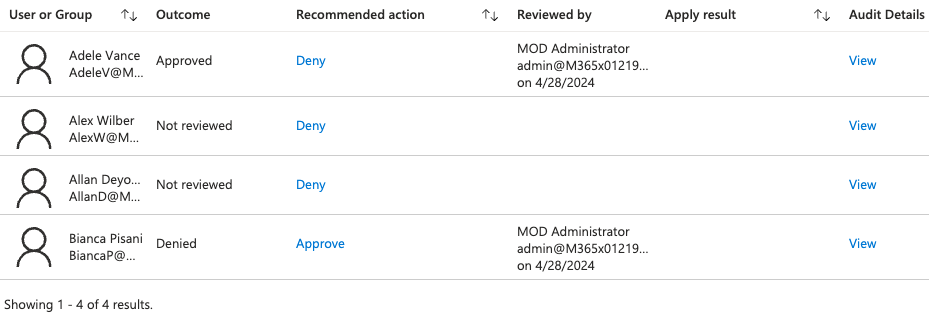
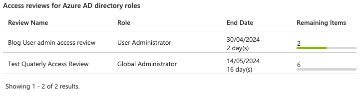

+++
title = 'Pim Access Review'
date = 2024-04-28T08:57:41+02:00
draft = false
+++

My team recently got an automation request concerning privileged role access review. I've always been on the consumer side, so getting some PIM hands-on automation sound like fun!
This was an interesting challenge on a few levels, I'll explain as we go along...

## What is PIM?

[PIM (Priveleged Identity Management)](https://learn.microsoft.com/en-us/entra/id-governance/privileged-identity-management/pim-configure) enables you to manage, control, and monitor access to important resources in your organization. The part we'll be focusing on is EntraId Role management. There's quite a bit you can do with PIM! I highly recommend reading the documentation!

## PIM prerequisites

The first challenge is having an environment to develop. PIM requires a P1/P2 license. You can start a trial for 30 days, but after that you have to pay. I'm quite frugal, so... not an option! That's why Dev tenants where awesome! I say where because they aren't readily available anymore. Which makes developing a challenge. EntraId admins aren't too keen on letting you play in their production tenant and rightly so! I got lucky and was able to use a colleague's almost expired dev tenant. Crisis adverted!

## PIM EntraId Role assigments

PIM role assignments gives you JIT (just in time) privileged access to Azure resources. Sometimes you do need elevated permission if only for a brief moment. PIM makes that possible!
I took this oppertunity to learn a bit more about PIM. The better you understand the process, the better chances of automating :wink:

With PIM you can make assignments for:

- Microsoft Entra roles
- Azure roles
- Groups

Here's where why understanding the process matters. At first I thought our objective was to create the assignments. No it wasn't. Then I got sidetracked with group access review. No that wasn't it either. So after a bit of back-and-forth, I came to understand it's just the access review bit for Microsoft Entra roles. The lesson here, don't overengineer...Still I'm glad I did invest some time in it... The more you know!

## PIM Microsoft Entra role Access review

As always the [online](https://learn.microsoft.com/en-us/graph/tutorial-accessreviews-roleassignments?toc=%2Fentra%2Fidentity%2Fprivileged-identity-management%2Ftoc.json&bc=%2Fentra%2Fidentity%2Fid-governance%2Fprivileged-identity-management%2Fbreadcrumb%2Ftoc.json&tabs=powershell) documentation does a better job at explaining this.

Right! Now that we agreed on what needs to be automated we can get started!

Here's something I'd advice when getting started on you PIM journey:

- Read the documentation! There we're quiet a few WTF's on my side that could have been avoided.
- Use an application. Best to get started with it right away! The documentation tells you which API permission you need, spoiler:
 it's _AccessReview.ReadWrite.All_ if you're feeling generous... _AccessReview.Read.All_ for only reporting.
- API permissions isn't enough, you application need to be assigned to a role depending on the resource. For Entra you have two options:
  - Identity governance administrator
  - Priveleged Role administrator

Here is the fun part when it comes to the role assignment, do you really want the application permanently assigned to the role? No, ofcourse not. That's where delegation comes in. But that's for another time.

I needed to give you all this background because it took me quite some attempts to fully understand what we wanted to accomplish which is the following:

> PIM Entra role access review sends a notification when an upcoming access reviewing is pending. It also sends a notification once the review end date passes and applies the decisions. there is no in between notification that tells you, in the case of multiple reviewers, if a reviewer already did the review.

So why would that be a concern? Well depending on how the access review is set up. every reviewer gets an email about the review and when it's done. Depending on the review window, the review will only be applied **after** the review end date or if a reviewer **stops** the review. Then it's applied immediately and notifications are sent out.

I had some trouble with the last bit. Yes, we can stop the review, but should we? The access review is there for reason. When there are multiple reviwers they can veto each others decision. That isn't the case once you stop the access review. I feel stopping the review process should be unanimously decided.

That's when we came up with the next best thing, make a report of access reviews that are eligible for closing. That way you can update the reviewers the current state and let them decide if it's done yes or no.

## PIM access review state

Testing access review isn't as straightforward as you'd think! When developing start off with a one-time review and work your way up. I added a quarterly review which start way later, which meant it didn't show up. It makes sense in hindsight...

When creating a one-time review always add an extra day to the end date. I noticed it failed without it.

Now for the actual fun bit! The code!!!

On of my responsibility as a senior is mentoring. Anyone who knows me, knows I'm a huge fan of PowerShell! Nothing makes me happier than coding in PowerShell :smile:

I created a simple module to get things going. This will suffice for now.

_**PimHelper.psm1**_

```pwsh
#Set script variable
$script:graphApiVersion = "Beta"
$script:baseUri = "https://graph.microsoft.com/$($graphApiVersion)"


function New-MgGraphLogin {
    param (
        $ClientId,
        $ClientSecret,
        $TenantId
    )

    $securePassword = ConvertTo-SecureString -String $ClientSecret -AsPlainText -Force

    $mgCredential = [pscredential]::new($ClientId, $securePassword)

    Connect-MgGraph -TenantId $TenantId -ClientSecretCredential $mgCredential -NoWelcome
}

function Get-AccessReviewDefinition {
    param(
        $ApiPath = 'identityGovernance/accessReviews/definitions'
    )

    $uri = "$baseUri/{0}" -f $ApiPath

    if (Get-MgContext) {
        (Invoke-MgRestMethod -Method GET -Uri $uri).value
    }
    else {
        Write-Error 'Please login to MgGraph first'
    }
}

function Get-AccessReviewDecisions {
    param (
        [object[]]$Definitions,
        $ApiPath = 'identityGovernance/accessReviews/definitions'
    )

    $Definitions |
    ForEach-Object {
        $displayName = $_.DisplayName
        $id = $_.id
        $status = $_.Status

        $uri = "$baseUri/{0}/{1}/instances/{1}/decisions" -f $ApiPath, $id

        $accessReviewDecision = (Invoke-MgRestMethod -Method GET -Uri $uri).value

        Write-Verbose "Decisions for [$displayName/$id] count [$($accessReviewDecision.count)]"

        if (!$accessReviewDecision) {
            [PSCustomObject]@{
                DisplayName = $displayName
                DefinitionId = $id
                AccessReviewStatus = "NotStarted"
                TargetDisplayName = $null
                ResourceDisplayName = $null
                Decision = 'NotReviewed' #Edge case NotStarted therefore NotReviewed
                Justification = $null
                ReviewedBy = $null
                ReviewedDateTime = $null
            }
        }

        $accessReviewDecision |
        ForEach-Object {
            [PSCustomObject]@{
                DisplayName = $displayName
                DefinitionId = $id
                AccessReviewStatus = $status
                TargetDisplayName = $_.target.userDisplayName
                ResourceDisplayName = $_.resource.displayName
                Decision = $_.decision
                Justification = $_.Justification
                ReviewedBy = $_.reviewedBy.userPrincipalName
                ReviewedDateTime = $_.reviewedDateTime
            }
        }
    }
}
```

The module helps me log in with my client credentials. There are two main functions:

- Get-AccessReviewDefinition. Retrieves the AccessReview definitions
- Get-AccessReviewDecisions. Retrieves the AccessReview decisions. There is an edge case. Decision count will be null if not started

I'm almost certain this will need refactoring. As far as MVP goes we have a working concept, it just works in my dev tenant... :grin:

Here's the script to get the current state of the AcccessReview currently in progress

_**Get-AccessReviewDecisionState.ps1**_

```pwsh
[CmdletBinding()]
param(
   $TenantId
)

Import-Module $PSSCriptRoot/pimHelper.psm1 -Force

$paramLogin = @{
    ClientId = 'your clientId'
    ClientSecret = 'your clientSecret. Ideally from a keyvault'
    TenantId = $TenantID
}

#Login MgGraph
New-MgGraphLogin @paramLogin

#Get AccessReview Definitions
$accessReviewDefinitions = Get-AccessReviewDefinition

Write-Verbose "AccessReview definition count [$($accessReviewDefinitions.count)]"

#Get ongoing AccessReviews
$ongoingAccessReview = $accessReviewDefinitions |
Where-Object {$_.Status -eq 'InProgress'} |
ForEach-Object {
    [PSCustomObject]@{
        DisplayName = $_.displayName
        Id = $_.Id
        Status = $_.status
        Details = $_
    }
}

$lookupOngoingAccessReview = $ongoingAccessReview | Group-Object -AsHashTable -AsString -Property Id

Write-Verbose "Ongoing AccessReview decisions count [$($ongoingAccessReview.count)]"

$accessReviewDecisions = Get-AccessReviewDecisions -Definitions $ongoingAccessReview

$lookupAccessReviewDecisions = $accessReviewDecisions |
Group-Object -AsHashTable -AsString -Property DefinitionId

#Find the access reviews eligable for closing
$eligibleToClose = $lookupAccessReviewDecisions.Keys |
ForEach-Object {
    $eligible = $false

    if ($lookupAccessReviewDecisions.$_.Decision -notcontains ('NotReviewed')) {
        $eligible =$true
    }

    $reviewed = $null
    $notReviewed = $null
    $totalCount = $null

    if ($lookupAccessReviewDecisions.$_.AccessReviewStatus -notcontains ('NotStarted')) {
        $reviewed = ($lookupAccessReviewDecisions.$_.Decision | Where-Object {$_ -ne 'NotReviewed'}).count
        $notReviewed = ($lookupAccessReviewDecisions.$_.Decision | Where-Object {$_ -eq 'NotReviewed'}).count
        $totalCount = ($lookupAccessReviewDecisions.$_).count
    }

    [PSCustomObject]@{
        DisplayName = $lookupOngoingAccessReview.$_.DisplayName
        DefinitionId = $_
        TotalCount = $totalCount
        ReviewedCount = $reviewed
        NotReviewedCount = $notReviewed
        Eligible = $eligible
    }
}

$eligibleToClose
```

here's what the output looks like



Two haven't been started and one is in progress. The total count for the one in progress is 4. Two haven't been reviewed. One has been approved and one denied.
A review can either be denied/approved



Which begs the question, remind me why we're doing this? I can see the progress in the portal...I think a better description of the process will help. Yes, a reviewer could stop the review once completed. If all are in agreement then by all means go ahead. As for the current state, have a look at the results in the Portal. Well actually, we don't want to waste time waiting on all the reviewers... Maybe have less reviewers then? :grin: Also, we'd like to complete the access review once a reviewer has done it. Then I'd suggest stopping it. If that is part of your agreement.

As for the state of the review, I found where I needed to look (Hindsight eh? :wink:):

You can find this under _Tasks - Review access_ in the Portal



We want to give the reviewers a heads up when the review has been done. The Portal does an execellent job of showing the results and the remaining items!
As for closing, let the reviewers decide if they'd like to stop the process to complete it.


## Conclusion

I had fun working on this assignment! In hindsight, I wonder if it is valid. I feel describing the access review process is the crucial bit. Make sure you're following business protocol. It is cool though using PowerShell to get the same insight... :wink: PowerShell is a means, not a reason in itself

Hope it helps you in your PIM journey and what you should be on the lookout for. Don't be afraid to question the status quo. Just because you can, doesn't mean you should...

Ttyl/Urv

## Additional resources:

- [PIM Documentation](https://learn.microsoft.com/en-us/entra/id-governance/privileged-identity-management/)
- [Review access roles](https://learn.microsoft.com/en-us/graph/tutorial-accessreviews-roleassignments?toc=%2Fentra%2Fid-governance%2Ftoc.json&bc=%2Fentra%2Fid-governance%2Fbreadcrumb%2Ftoc.json&tabs=http)